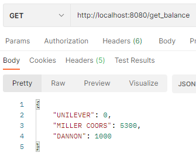

# FetchRewardsCodingChallenge 

## About:

A simple Spring Web Server as part of the Fetch Rewards Assessment.

## Dependencies:

To run this project export the project into any IDE as a maven project.  
Start the application in the IDE as a Spring Boot Application.

## Running the project:

From IDE IntelliJ in github go to the code tab on the repository and copy the https link.
Then you go to File -> New -> Project From Version Control -> and paste in that URL and the project will run on Intellij.
You can also download the Github Project and open it up in your local IDE.

In order to run the project run the FetchRewardsCodingChallengeApplication Class which is in src/main/java/com.interview.fetchrewardscodingchallenge.  
Once you see this line the project is running:
2022-01-02 14:43:15.249  INFO 12576 --- [-192.168.43.159] o.s.web.servlet.DispatcherServlet        : Completed initialization in 3 ms you are ready to start.

The server is running at http://localhost:8080/.

In order to unit test make sure FetchRewardsCodingChallengeApplication is running and then run the PayerControllerTest in order to check all tests are running.

## REST API Endpoints:

/get_balance is a GET Method which retrives the points balance in the user's account

/add_transaction is a POST Method which takes in a JSON object of a Payer to add it to the User Account

/spend_points is a DELETE Method which takes in a JSON Integer to deduct the points from the User Account

## Testing:
In src/test/java/Tests there is a PayerControllerTest Class.  
Run this class in order to test if all of the Rest API Endpoints are working properly and doing what they are
supposed to be doing.
Make sure that FetchRewardsCodingChallengeApplication Class which is in src/main/java/com.interview.fetchrewardscodingchallenge is running when you are running the Unit Tests.

## Sending Responses:
The simplest method to view the API endpoints is using the API client Postman.  Below are some pictures of what to enter into postman and the responses given.

Adding a new transaction using POSTMAN API:

Spending Points with the POSTMAN API:

Getting the User Balance with the POSTMAN API:

Another method is using CURL which gives the same responses as POSTMAN.

POST add_transaction:
curl --location --request POST 'http://localhost:8080/add_transaction' \
--header 'Content-Type: application/json' \
--data-raw '{ "payerName": "DANNON", "points": 1000, "timestamp": "2020-11-02T14:00:00Z" }'

DELETE spend_points:
curl --location --request DELETE 'http://localhost:8080/spend_points' \
--header 'Content-Type: application/json' \
--data-raw '5000'

GET get_balance:
curl --location --request GET 'http://localhost:8080/get_balance' \
--data-raw ''

# Resources:

[Spring Documentation](https://spring.io/projects/spring-boot)

[Postman](https://www.postman.com/)
